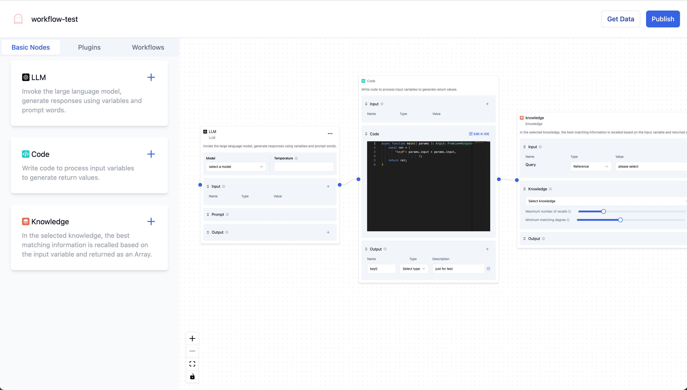

# Vue Flow Quickstart and Best Practices 🚀

This project demonstrates building workflow apps with Vue Flow and Vue.js.

## Table of Contents

- [Introduction](#introduction)
- [Demo](#demo)
- [Getting Started](#getting-started)
- [Tech Stack](#tech-stack)
- [Contributing](#contributing)

## Introduction

Vue Flow is a library for flowchart diagrams. This project shows quickstart and best practices:

- Drag and drop nodes 🖱
- Connect nodes ➡️
- Customize nodes ⚙️
- Pass data between nodes 📤
- Save/restore workflows 💾

## Demo

https://chat-bot-workflow.vercel.app/

Try the live demo 🖥

## Getting Started

These steps will get you started:

- Prerequisites: Node.js (v16+) and pnpm
- Clone the repo
- Install dependencies with `pnpm install`
- Start dev server with `pnpm run dev`
- App will be at http://localhost:5173/

## Tech Stack

- [Vue Flow](https://vueflow.dev/) - Flowchart
- [Vue.js](https://vuejs.org/) - Framework
- [Tailwind CSS](https://tailwindcss.com/) - Styling
- [Shadcn-vue](https://www.shadcn-vue.com/) - UI components
- [Vite](https://vitejs.dev/) - Build tool

## Contributing

Feel free to open PRs to contribute fixes or improvements!
